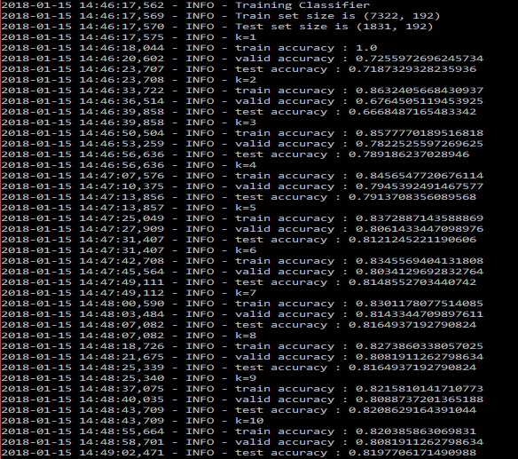

# Récupérer les images et les sauvegarder
---

```
classify_pages.py --images-list classes.csv --save-features saved
```

Seulement 9153 images récupérées (probleme de path)


# Tester avec un knn de 1
---

```
classify_pages.py --load-features saved --nearest-neighbors 1
```

Résultat : 0.74877


# Tester avec un knn de 1 à 10
---

```
classify_pages.py --load-features saved --knn
```



Meilleur : knn = 9 avec un test accuracy = 0.82086


# Tester avec logistic regression
---

```
classify_pages.py --load-features saved --logistic-regression
```

Résultat: 0.81376

